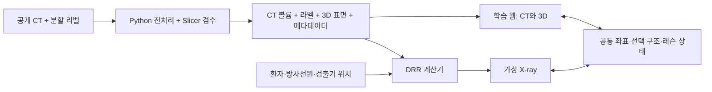

# CT·3D 해부학·X-ray 연동 학습 도구 개발 계획

조사일: 2026-09-12. 목적: 해부 구조의 위치·형태·중첩 이해와 촬영 방향·중심선·거리의 기하학적 감각 학습. 아래 일정·성능·예산은 계획 추정치이며 실제 구현 벤치마크가 아니다.

## 1. 권장 결정

**3D Slicer에서 공개 CT와 라벨을 검증하고, React + TypeScript + vtk.js 학습 웹에 CT 단면·동일 CT의 3D 구조·CT로 계산한 가상 X-ray(DRR)를 연결한다.** DRR는 Python에서 DiffDRR/nanodrr를 비교한 뒤 하나를 채택한다. 처음에는 로컬 PC에서 실행하고, 검증된 사례와 미리 계산한 영상만 웹에 배포한다.

처음부터 전신 관절 운동, 진단 AI, 실제 장비의 노출 재현을 만들지 않는다. 첫 학습 단위는 복부 장기 탐색과 골반·요추의 강체 회전/투영이다. 첫 사례가 검증된 다음 사례 3~5개, 레슨 10개 정도로 확장한다.

첨부 화면에서 확인되는 것은 장기 선택, 3D 구조, CT 사단면, 단면 위치·기울기·명암 조절이다. 정지 화면으로 실제 정확도나 구현 기술은 확인할 수 없다. 화면 속 일본어는 참고 UI이며 사용자 지시로 취급하지 않았다.

## 2. 서로 다른 네 가지 화면

| 화면 | 데이터와 역할 | 연결 방식 |
|---|---|---|
| 2D 해부도 | 이름과 관계를 익히는 설명용 그림 | structureId로 의미를 연결. 다른 인체 그림과 실제 CT 좌표가 같다고 가정하지 않음 |
| CT 단면 | 같은 CT의 횡단·관상·시상·사단면 | 환자 좌표계의 선택점과 절단면 공유 |
| 3D 해부 구조 | 해당 CT의 장기·뼈 라벨에서 만든 표면 | CT와 동일한 공간 변환·단위 사용 |
| 가상 X-ray | 동일 CT를 방사선원에서 검출기로 투영한 DRR | 환자·방사선원·검출기의 위치로 계산 |

CT 사단면과 X-ray 투영은 다르다. 전자는 얇은 평면을 재구성하고, 후자는 경로에 있는 조직의 감쇠를 누적한다. 3D 표면을 회색으로 렌더링하거나 CT를 MIP로 표시하는 것만으로 일반 X-ray를 재현할 수 없다. DRR 구현 근거: [DiffDRR](https://github.com/eigenvivek/DiffDRR).

사용 예: 오른쪽 신장을 고르면 3D에서 강조하고, CT에서 해당 라벨과 단면을 표시하며, DRR에서는 신장이 투영되는 영역을 교육용 색으로 덧씌운다. 색상 영역은 실제 단순 X-ray에서 그 장기가 선명하게 보인다는 뜻이 아니다.

X-ray 한 픽셀에는 여러 구조가 겹친다. 클릭하면 단 하나의 3D 장기를 정답처럼 선택하지 않고, 해당 광선과 교차하는 구조 목록·깊이 순서·관련 CT 단면을 보여준다.

## 3. 오픈소스 도구 비교

| 도구 | 역할 | 확인한 조건 | 채택 판단 |
|---|---|---|---|
| [3D Slicer](https://www.slicer.org/) | CT·라벨·3D 확인, 편집, 기준 화면 제작 | 무료 오픈소스 데스크톱 플랫폼 | 가장 먼저 사용. 데이터 검수 도구 |
| [SlicerRT](https://slicerrt.github.io/) | Slicer의 방사선치료 연구 확장 | Windows·Mac·Linux 설치 안내 제공 | DRR 관련 기능의 현재 버전 동작을 검증하는 보조 후보 |
| [vtk.js](https://github.com/Kitware/vtk-js) | 브라우저 CT/표면 렌더링 | BSD-3-Clause | 사전 가공 사례 중심 MVP의 주 렌더러 |
| [Cornerstone3D](https://github.com/Cornerstonejs/cornerstone3D) | 의료영상 뷰포트와 도구 | MIT | 실제 DICOM 로딩/측정 요구가 생기면 검토 |
| [OHIF Viewer](https://github.com/OHIF/Viewers) | 완성형 DICOM 웹 뷰어 | MIT | 비교·참고용. 교육 UI의 첫 기반으로는 범위가 큼 |
| [TotalSegmentator](https://github.com/wasserth/TotalSegmentator) | CT 장기·뼈 자동 분할 | 기본 total 작업은 Apache-2.0 공개, 일부 추가 작업은 별도 조건 | 이미 있는 라벨부터 사용. 부족할 때 전처리로 실행 |
| [DiffDRR](https://github.com/eigenvivek/DiffDRR) | CT에서 DRR 생성 | MIT, PyTorch | 기준 구현·예제용 |
| [nanodrr](https://github.com/eigenvivek/nanodrr) | DiffDRR 후속 최적화 구현 | MIT, 제작자 권장. CUDA용 최적화 포함 | 동일 CT/기하에서 속도·메모리·영상 비교 후 우선 채택 |
| [DeepDRR](https://github.com/arcadelab/deepdrr) | 물질·산란·노이즈를 고려한 X-ray 합성 | GPL-3.0. 공식 설치는 Linux + NVIDIA/CUDA 필요 | 후속 현실감 연구용. 첫 Mac 기반 MVP에는 제외 |

Cornerstone3D는 내부적으로 vtk.js를 사용한다. 첫 버전에서 Cornerstone3D와 별도 vtk.js·Three.js 엔진을 모두 겹쳐 쓰면 좌표 동기화와 메모리 관리가 복잡해진다. 사전 가공 볼륨 중심이면 vtk.js 하나로 시작한다. [공식 렌더링 설명](https://www.cornerstonejs.org/docs/concepts/cornerstone-core/renderingengine/)

nanodrr의 저장소 성능 수치는 저자 환경의 보고이며 우리 앱의 속도를 보장하지 않는다. CUDA 최적화가 Mac에서도 그대로 작동한다고 가정하지 않는다.

## 4. 무료 데이터 선정

| 자료 | 활용 | 조건·주의 | 우선순위 |
|---|---|---|---|
| [TotalSegmentator v3](https://zenodo.org/records/22688904) | CT와 장기/뼈 라벨로 모든 화면의 공간적 기반 생성 | 2026-09-10 공개, 1,939 CT·117 구조, 압축 37.4GB. Zenodo API에서 CC BY 4.0 확인 | 1순위. 먼저 성인 사례 1개, 이후 3~5개 검수 |
| [CT-ORG](https://www.cancerimagingarchive.net/collection/ct-org/) | 주요 장기와 CT 연동의 대체 사례 | 140 CT, CC BY 3.0. 공식 페이지에 일부 좌우 반전 주의가 명시됨 | 좌우 검증을 통과한 사례만 보조 사용 |
| [NLM Visible Human](https://www.nlm.nih.gov/research/visible/visible_human.html) | 실제 해부 절단사진과 CT를 함께 배우는 고급 레슨 | NLM은 public-domain 자료로 안내하고 2019년부터 접근 라이선스 불필요. 사체·영상 간 변형/정합 검증 필요 | 2차 확장 |
| [BodyParts3D](https://lifesciencedb.jp/bp3d/info_en/license/index.html) | 전신 구조와 2D 설명도 제작 | 공식 이용조건 CC BY-SA 2.1 Japan. 저작자 표시와 공유조건 반영 | 개념 설명용 보조 아틀라스 |
| [MIMIC-CXR](https://physionet.org/content/mimic-cxr/2.1.0/) | 실제 흉부 X-ray 비교 연구 | 교육 이수·사용자 인증·DUA 필요. 자유 재배포 자료가 아님 | 공개 MVP에 포함하지 않음 |

TotalSegmentator 저장소의 구형 데이터 건수와 최신 Zenodo 건수가 다르므로 버전 DOI·파일 체크섬을 고정한다. 코드 라이선스와 데이터 라이선스는 따로 기록한다. [데이터 메타데이터 API](https://zenodo.org/api/records/22688904)

이 목록의 CT와 X-ray를 임의로 묶으면 동일 인체의 정답 쌍이 되지 않는다. MVP의 정확한 연결은 동일 CT에서 만든 DRR로 확보한다. 실제 X-ray는 별도 사례로 명확히 구분한다. 향후 실제 CT–X-ray 정합 검증에는 동일 대상과 촬영 기하가 알려진 자료나 팬텀이 필요하다.

자료가 많다는 것보다 교육용 적합성이 중요하다. CT 범위가 골반 전체를 포함하는지, 절단·금속·심한 병변이 없는지, 라벨이 맞는지 확인한다. 임상 CT를 정상인의 대표 해부학으로 자동 취급하지 않는다. v3의 소아 사례는 초기 성인 레슨과 섞지 않는다.

전체 데이터부터 다운로드하지 않는다. 공식 페이지의 소규모 하위집합 또는 라이선스가 확인된 사례로 시작하되, 하위집합은 자체 버전·라벨 범위를 다시 확인한다.

## 5. 사용자가 실제로 배우는 과정

### 해부학 모드

1. 한국어/영어 구조 이름을 검색하고 2D 개요에서 위치를 확인한다.
2. 동일 사례의 3D 장기와 뼈를 선택·숨김·반투명 표시한다.
3. CT 세 기본 단면과 사단면을 이동하며 모양이 변하는 이유를 확인한다.
4. 장기 라벨을 숨기고 위치 맞히기, 좌우 구별, 연속 단면 추적을 수행한다.

2D 개요는 최초에는 동일 CT의 라벨/표면으로부터 단순화한 그림을 제작한다. 외부 아틀라스의 다른 인체를 정확히 겹치는 작업을 줄이고, 구조 ID의 일관성을 유지할 수 있다.

### 촬영 기하 모드

1. 골반 또는 요추의 기준 방향을 선택한다.
2. 인체의 강체 회전, 관구 방향, 중심선 위치, 검출기 위치를 독립 조절한다.
3. 방사선원–검출기 거리(SID), 대상–검출기 거리(OID), 조사야를 시각화한다.
4. DRR 변화와 3D 광선 경로를 함께 확인한다.
5. 구조 중첩·확대·잘림을 비교하고 무엇을 바꾸면 개선되는지 설명한다.

첫 레슨은 AP/측면/사위의 기하학적 비교와 작은 회전 오차, 중심 이탈, 거리 변화다. 구체적인 표준 촬영 각도·허용 범위·중심선 위치는 방사선사/교수자가 채택한 교육자료를 검수해 등록한다. 이 계획의 임의 값으로 임상 촬영 기준을 만들지 않는다.

### 피드백 설계

- 자유 탐색 → 결과 예측 → 가상 촬영 → 기준 영상 비교 → 재시도 흐름.
- 점수 하나보다 중심 오차(mm), 회전 오차(도), 포함 영역, 랜드마크 중첩을 분리해 제공.
- 허용 오차는 사례별 전문가 검수 후 설정. 자동 점수는 임상 적합 판정으로 표현하지 않음.
- 초급은 색 라벨·힌트, 중급은 힌트 숨김, 복습은 오답 조건 재현.
- 첫 레슨 10개: 좌우/세 단면, 장기 찾기, 연속 단면 추적, 사단면 이해, 골반 기준 방향, 골반 회전, 요추 중첩, 중심 이탈, 거리와 확대, 조사야 잘림.

## 6. 기술 구성과 데이터 흐름

권장 개발 구성은 다음과 같다. 이는 우리 프로젝트의 선택안이며 각 도구가 완성된 학습 기능을 제공한다는 뜻은 아니다.

| 구분 | 선택 | 목적 |
|---|---|---|
| 개발 환경 | Codex 또는 VS Code, Git | 코드 작성·변경 기록 |
| 화면 | React + TypeScript + Vite | 학습 UI와 상태 관리 |
| 영상 | vtk.js | CT 단면·3D 구조·절단면·광선 시각화 |
| 전처리 | Python + SimpleITK/nibabel + VTK | HU·좌표 보존, 라벨 정리, 표면 생성 |
| DRR | nanodrr 또는 DiffDRR | 기하 기반 가상 X-ray 계산 |
| API | FastAPI, 필요할 때만 실행 | 자유 각도의 계산 요청 처리 |
| 학습 콘텐츠 | 버전 관리한 JSON/Markdown | 레슨, 설명, 랜드마크, 평가 규칙 |
| 진도 저장 | 브라우저 IndexedDB | 첫 버전의 개인 학습 기록 |
| 배포 | 정적 웹 + 사례 파일 저장소 | 고정 사례와 미리 계산한 DRR 배포 |
| 후속 서버 | Linux GPU 작업자 + 요청 큐 | 여러 사용자 자유 각도 계산 |

처음에는 계정·DB·PACS 서버가 없어도 된다. DICOM 원본은 전처리에서 읽고 웹에는 정규화한 볼륨/표면을 보낸다. 실제 DICOM 가져오기가 제품 요구로 확정될 때 Cornerstone3D와 로컬 파일 로딩을 별도 작업으로 검토한다.

### 좌표와 정확성의 필수 설계

- 내부 기준을 환자 물리 좌표 LPS, 길이 mm로 명시한다. NIfTI affine의 RAS 등은 입력에서 명시적으로 변환한다.
- 원점·간격·축 방향·voxel-to-world 변환을 보존하고, CT/라벨/표면/투영에 동일하게 적용한다.
- 슬라이스를 파일명 순서로 배열하지 않는다. DICOM 방향·위치 정보와 HU rescale을 반영한다.
- CT는 연속값 보간, 라벨은 최근접 보간을 사용한다. CT와 라벨의 공간 일치를 확인한다.
- 3D 카메라 회전과 환자 실제 회전은 독립 상태다. 둘을 혼동하면 화면을 둘러보는 것만으로 촬영 결과가 바뀐다.
- 검출기 픽셀 크기·축·원점, 방사선원 위치를 저장한다. AP/PA 표시는 광선 방향을 기준으로 검증한다.
- DRR에서는 HU를 감쇠/밀도로 변환하는 가정을 기록한다. CT window/level을 바꿔도 원래 투영값이 바뀌지 않도록 한다.
- 투영 이미지를 화면에 맞춰 자동 확대하는 기능과 물리적 확대율을 구분한다. 검출기 좌표·눈금을 유지한다.
- 장기를 화면에서 숨기는 행동은 기본적으로 DRR 감쇠에서 장기를 제거하지 않는다. 별도 '구조별 기여도' 학습 모드로 표시한다.

### 사례 패키지

`case.json`에는 caseId, 출처 DOI, 라이선스, 인용, 원본 체크섬, 전처리 버전, 좌표 변환, CT 범위/자세, 구조 목록, 검수 상태를 기록한다. CT 원본 파생 볼륨·라벨·경량 표면·기준 투영 조건·레슨을 묶어 재현 가능한 버전으로 저장한다.

## 7. 현실감의 범위

**첫 버전이 훈련하는 것은 해부학적 위치와 촬영 기하다.** 누운 CT를 회전해도 중력에 따른 장기 이동, 기립 자세, 호흡, 팔 올림, 무릎 굴곡은 재현되지 않는다. '기립 PA 흉부 완전 재현'이나 관절 포지셔닝을 초기 성공 기준으로 넣지 않는다.

실제 X-ray의 산란·에너지 스펙트럼·검출기 반응·후처리·조영제 영향도 단순 DRR와 다를 수 있다. kVp/mAs 슬라이더를 단순 밝기 조절로 만들면 잘못된 학습을 유발할 수 있으므로 초기에는 제공하지 않는다. 노출과 선량 교육은 별도 물리 모델과 교육자 검증을 거친 후 추가한다. [DeepDRR의 모델과 제한](https://github.com/arcadelab/deepdrr)

관절 움직임은 3D 겉모양만 변형하면 CT와 불일치한다. 후속 단계에서 자세별 CT, 정합/변형 볼륨, 또는 명확히 구분한 개념용 관절 모델 중 하나를 선택한다. 실무 손기술·환자 협조·촉진 감각은 모형/실습 교육과 결합한다.

## 8. 구현 순서와 완료 기준

아래는 개발자 1명 전일 작업 + 주기적인 방사선사/교수자 검수 기준 추정이다. AI 보조 여부보다 데이터 품질과 GPU 호환성이 일정에 큰 영향을 준다.

| 단계 | 예상 기간 | 산출물 | 다음 단계 진입 조건 |
|---|---|---|---|
| 0. 타당성 검증 | 3~5일 | 사례 1개, Slicer 기준 화면, AP/측면/사위 DRR | 좌우·형태·거리 확인, 엔진 실행 성공 |
| 1. CT–3D 연동 | 1~2주 | 구조 선택, 3단면/사단면, 3D 절단면, 2D 개요 | 기준점 위치가 Slicer와 일치 |
| 2. 촬영 기하 | 2~3주 | 환자/관구/검출기 조절, DRR, 투영 중첩 표시 | 기하 팬텀 테스트 및 전문가 영상 검수 통과 |
| 3. 학습 기능 | 1~2주 | 10개 레슨, 조건 비교, 오답 복습, 진도 | 교육자 검수와 사용자 과제 수행 확인 |
| 4. 안정화·공유 | 약 1주 | 3~5 사례, 브라우저 검증, 라이선스 목록, 사용법 | 목표 PC에서 로딩·메모리·반응성 측정 |

총 약 6~9주를 첫 교육용 MVP의 계획 범위로 잡는다. 1~2주 안에는 한 사례의 CT–3D 연동과 고정 각도 DRR 데모를 목표로 할 수 있지만, 실제 개발·의학 검수가 끝난 일정 보장은 아니다. 전신 관절·호흡·실제 노출 재현은 이 일정 밖의 별도 프로젝트다.

### 가장 먼저 실행할 작업

1. 3D Slicer를 설치하고 라이선스가 확인된 성인 CT/라벨 한 사례를 확보한다.
2. 복부–골반 범위, 좌우, 척추 번호, 장기 라벨을 검수한다.
3. 동일 데이터로 DiffDRR/nanodrr 각각 저해상도 투영 3개를 만들어 좌표와 성능을 비교한다.
4. 엔진·사례 버전을 고정하고 웹의 CT 단면/3D 연동을 구현한다.
5. '골반을 조금 회전하면 어떤 구조가 더 겹치는가' 레슨 하나를 끝까지 완성한다.

## 9. 검증 계획

| 검증 | 수용 기준 제안 |
|---|---|
| CT–3D 기준점 | 검수한 랜드마크의 동기화 오차가 원본 1 voxel 이내 |
| 좌우와 축 | 비대칭 인공 팬텀으로 L/R, A/P, S/I와 AP/PA 반전 확인 |
| 사단면 | 동일 절단면을 Slicer와 비교. 위치·방향·형태 확인 |
| 투영 기하 | 단순 점/구 팬텀의 해석적 투영과 1 detector pixel 이내 목표 |
| 확대 | 단순 팬텀에서 SID/SOD에 따른 확대율과 비교 |
| 파이프라인 | crop/resample 뒤 CT·라벨·표면·DRR의 변환 일치 |
| 표시 | W/L, 장기 숨김, 카메라 조작이 의도하지 않은 투영 변경을 만들지 않음 |
| 교육 품질 | 방사선사 또는 교수자가 레슨별 설명·방향·평가 기준 승인 |
| 학습 효과 | 학생/실무자 3~5명 파일럿에서 위치 찾기와 오차 수정 과제를 관찰 |

공학적 위치 오차와 분할 라벨 자체의 해부학적 정확성은 별개로 검수한다. AI가 만든 라벨을 자동으로 정답 처리하지 않는다.

성능 목표는 지정한 PC/브라우저에서 CT·3D 조작 30fps 수준, 저해상도 DRR 0.5~1초, 최종 DRR 2~3초 이내를 우선 가설로 둔다. 미달하면 해상도·ROI를 조정하고 고정 각도 캐시로 축소한다. 드래그 중 낮은 해상도, 손을 떼면 최종 계산을 하고 오래된 요청을 취소한다. 이는 측정 전 목표이며 제품 약속이 아니다.

## 10. 장비·비용·운영

현재 Mac의 CPU/GPU/메모리는 조사하지 않았다. 먼저 보유 장비로 1사례를 검증하고 구매를 결정한다.

- 학습 웹/소규모 개발: RAM 16GB 이상을 시작 기준, 여러 볼륨 전처리는 32GB를 계획상 권장한다. 이는 이번 프로젝트의 예산 가정이다.
- 37.4GB 원본 압축을 전부 사용할 경우 해제·가공·캐시를 위한 추가 여유 공간이 필요하다. 처음부터 전체를 받을 이유는 없다.
- GPU가 없으면 DRR를 미리 계산해 고정 각도에서 학습한다. 자유 각도·거리 조합 전체를 캐시할 수는 없다.
- Mac에서 DRR 백엔드가 느리거나 지원되지 않으면, 선택적으로 Linux/NVIDIA GPU에서 전처리한다. DeepDRR의 공식 요구는 이 환경이다.
- 여러 사람이 자유롭게 각도를 조절하는 공개 서비스는 GPU 서버·큐·동시 실행 제한·캐시가 필요하다. 이 경우 서버 비용을 0원이라고 약속할 수 없다.
- 비용은 도구 이용료, 저장/전송, GPU 계산 시간, 교육자 검수 인건비로 나눠 산정한다. 구체적인 호스팅 상품·가격은 배포 규모와 실제 사용량을 측정한 후 조회한다.

가장 작은 로컬 버전은 선택한 공개 도구에 대한 구매 없이 시작할 수 있다. 기존 하드웨어, 인터넷, 전기, 개발·검수 시간은 별도다. GPU 장비 구매, 유료 API, 계정 시스템은 초기 필수가 아니다.

## 11. 확장 우선순위

1. 흉부 해부학과 투영 중첩: 먼저 기존 CT 자세에서의 기하 학습, 기립/호흡 재현은 별도.
2. 경추·어깨·무릎: 적합한 CT·세밀한 라벨·포지셔닝 자료 확보 후.
3. Visible Human의 실제 해부 절단사진: CT와의 정합 오차를 검증하며 추가.
4. 실제 X-ray 비교: 공개 웹에 표시할 권리가 확인된 자료를 별도 사례로 추가.
5. 검증된 물리 모델에 기반한 노출·노이즈 교육.
6. 필요가 확인되면 태블릿 최적화·교수자 레슨 편집·계정 동기화.

## 12. 이번 조사에서 확인한 것과 남은 것

공식 저장소/문서/데이터 페이지와 Zenodo API로 도구 역할, 주요 라이선스, 최신 TotalSegmentator 데이터 규모를 확인했다. 저장소를 설치·실행하거나 CT를 내려받아 영상 품질·속도를 검증하지는 않았다. 따라서 엔진 호환성, 사례별 라벨 품질, 실제 기기 성능은 0단계에서 확인한다.

최초 제품 범위는 **복부 해부학 + 골반/요추 투영 기하 학습 웹**으로 권장한다. 기술적 난점은 예쁜 3D 화면보다 좌표의 일치, 투영의 정확성, 교육 내용의 검수다.
